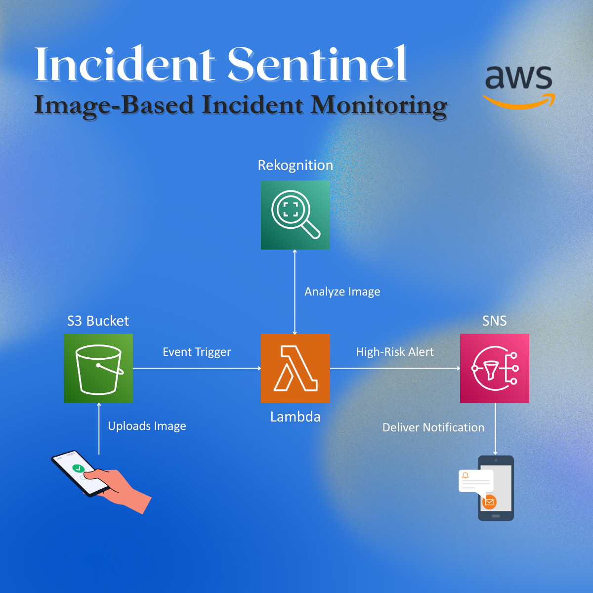

# Incident Sentinel

[](https://aws.amazon.com/)
[](https://www.python.org/)
[]()
[]()

**Automated security monitoring system powered by AWS Serverless and Computer Vision.**

Incident Sentinel is an event-driven cloud application. It monitors S3 buckets for uploaded images, uses **Amazon Rekognition** to detect safety hazards (weapons, fire, accidents), and triggers real-time alerts via **Amazon SNS**.

---

## Table of Contents
1. [Architecture](#architecture)
2. [Features](#features)
3. [Tech Stack](#tech-stack)
4. [Setup Guide](#setup-guide)
5. [Output Samples](#output-samples)

---

## Architecture



The system follows a completely serverless event-driven pattern:
`S3 Upload -> Lambda Trigger -> Rekognition Analysis -> Threat Filter -> SNS Alert`

---

## Features

* **Zero-Latency Monitoring:** Triggers immediately when a file hits the bucket.
* **Confidence Scoring:** Filters out low-confidence predictions to prevent spam.
* **Cost Efficient:** Uses serverless compute (Lambda) which scales to zero when idle.
* **Secure:** Runs with least-privilege IAM roles.

---

## Tech Stack

| Component | Service | Description |
| :--- | :--- | :--- |
| **Compute** | AWS Lambda | Python 3.9 execution environment |
| **Storage** | Amazon S3 | Ingests surveillance images |
| **AI/ML** | Amazon Rekognition | Deep learning based label detection |
| **Alerting** | Amazon SNS | Publishes email/SMS notifications |
| **IaC** | Boto3 SDK | Programmatic infrastructure management |

---

## Setup Guide

### 1. Configuration
Update the configuration variables in `lambda_function.py`:

```python
# Confidence thresholds (0-100)
THREATS = {
    "Weapon": 85,
    "Fire": 90,
    "Violence": 85
}
```

### 2. IAM Permissions
Ensure your Lambda Execution Role has these policies attached:
* `AmazonRekognitionReadOnlyAccess` (or specifically `rekognition:DetectLabels`)
* `AmazonSNSFullAccess` (or specifically `sns:Publish`)
* `AmazonS3ReadOnlyAccess` (or specifically `s3:GetObject`)

---

## Output Samples

**1. Console Log (CloudWatch)**
```text
[INFO] Processing: cam_04_warehouse.jpg
[INFO] Incident Sentinel: Alert sent at 2025-12-28 23:15:00
```

**2. Email Notification**
```text
Subject: [ALERT] High-Risk Incident

INCIDENT DETECTED
Time: 2025-12-28 23:15:00
File: s3://incident-sentinel-upload/fire_test.jpg
Data: {'Fire': 98.2, 'Smoke': 89.5}
```

---

**Disclaimer:** This project is for educational purposes. Always review security configurations before deploying to production.